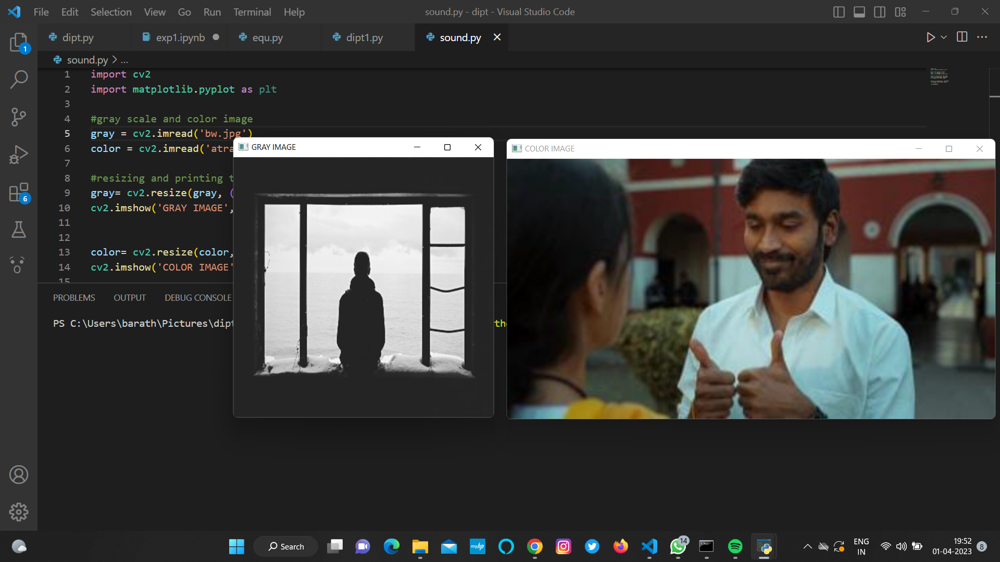
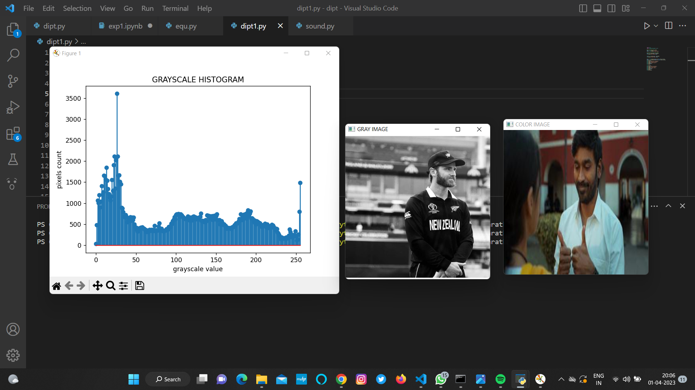
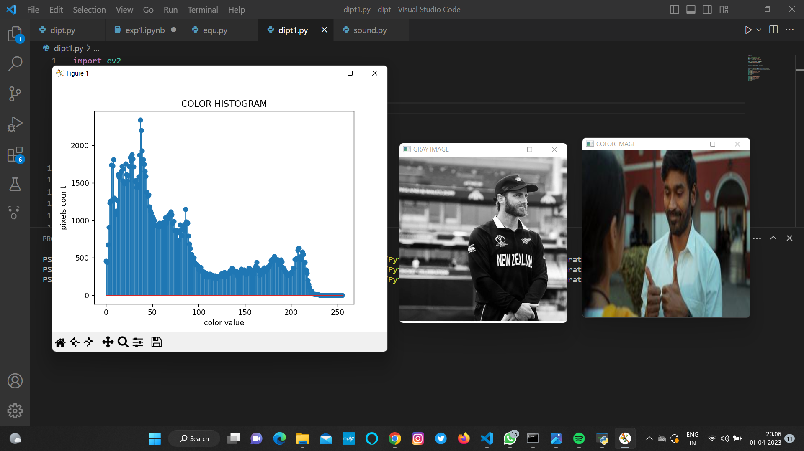
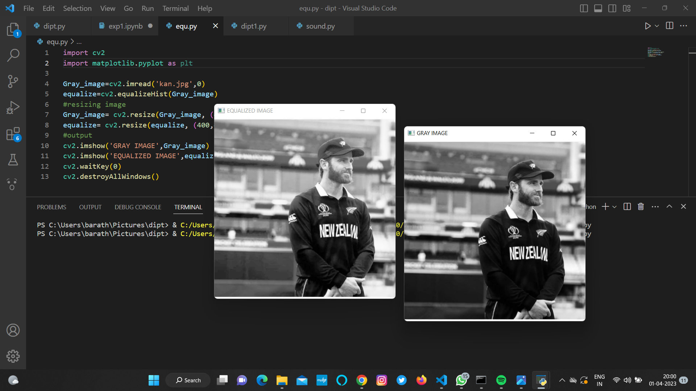

# Histogram and Histogram Equalization of an image
## Aim
To obtain a histogram for finding the frequency of pixels in an Image with pixel values ranging from 0 to 255. Also write the code using OpenCV to perform histogram equalization.

## Software Required:
Anaconda - Python 3.7

## Algorithm:
### Step1:
Read the gray and color image using imread()

### Step2:
Print the image using imshow().

### Step3:
Use calcHist() function to mark the image in graph frequency for gray and color image.

### Step4:
cv2.equalize() is used to transform the gray image to equalized form.

### Step5:
The Histogram of gray scale image and color image is shown.

## Program:
# Developed By: Soundariyan M N
# Register Number: 212222230146

# Write your code to find the histogram of gray scale image and color image channels.
```python
import cv2
import matplotlib.pyplot as plt 

#gray scale and color image  
gray = cv2.imread('bw.jpeg')
color = cv2.imread('atrangi.jpg')

#resizing and printing the image 
gray= cv2.resize(gray, (400,400))
cv2.imshow('GRAY IMAGE',gray)


color= cv2.resize(color, (400,400))
cv2.imshow('COLOR IMAGE',color)
cv2.waitKey(0)
```


# Display the histogram of gray scale image and any one channel histogram from color image
```python
import cv2
import matplotlib.pyplot as plt 

#gray scale and color image  
gray = cv2.imread('bw.jpeg')
color = cv2.imread('atrangi.jpg')

#resizing and printing the image 
gray= cv2.resize(gray, (400,400))
cv2.imshow('GRAY IMAGE',gray)


color= cv2.resize(color, (400,400))
cv2.imshow('COLOR IMAGE',color)


hist = cv2.calcHist([gray],[0],None,[256],[0,256])
hist1 = cv2.calcHist([color],[1],None,[256],[0,256])
plt.figure()
plt.title("GRAYSCALE HISTOGRAM")
plt.xlabel('grayscale value')
plt.ylabel('pixels count')
plt.stem(hist)
plt.show()

plt.figure()
plt.title("COLOR HISTOGRAM")
plt.xlabel('color value')
plt.ylabel('pixels count')
plt.stem(hist1)
plt.show()
cv2.waitKey(0)

```


# Write the code to perform histogram equalization of the image. 
```python
import cv2
import matplotlib.pyplot as plt 

Gray_image=cv2.imread('bw.jpeg',0)
equalize=cv2.equalizeHist(Gray_image)
#resizing image 
Gray_image= cv2.resize(Gray_image, (400,400))
equalize= cv2.resize(equalize, (400,400))
#output
cv2.imshow('GRAY IMAGE',Gray_image)
cv2.imshow('EQUALIZED IMAGE',equalize)
cv2.waitKey(0)
cv2.destroyAllWindows()
```


## Output:
### Input Grayscale Image and Color Image


### Histogram of Grayscale Image


### Histogram of Color Image


### Histogram Equalization of Grayscale Image


## Result: 
Thus the histogram for finding the frequency of pixels in an image with pixel values ranging from 0 to 255 is obtained. Also,histogram equalization is done for the gray scale image using OpenCV.
